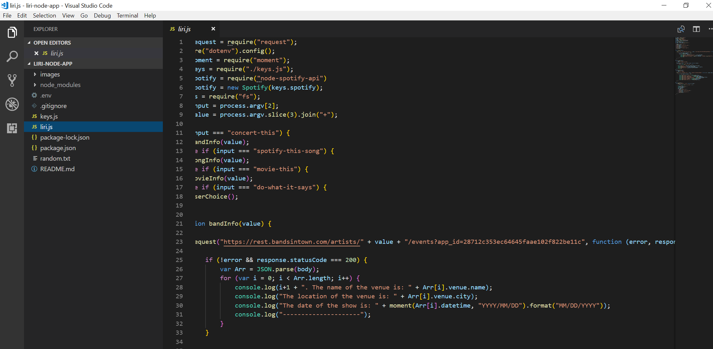
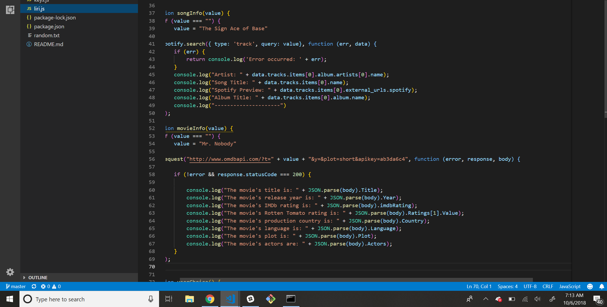
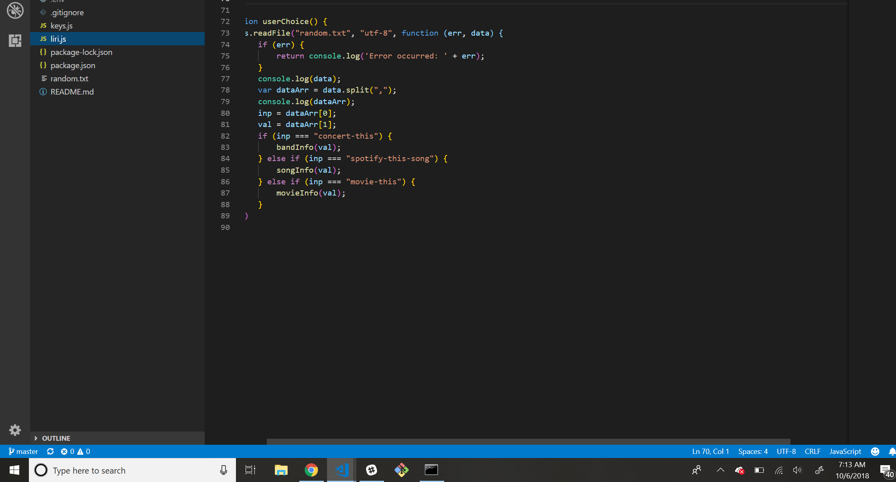
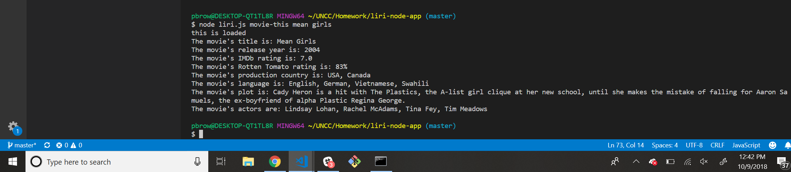
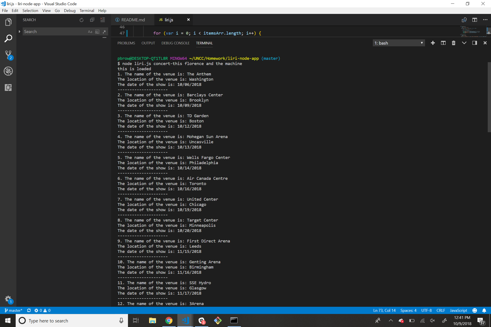
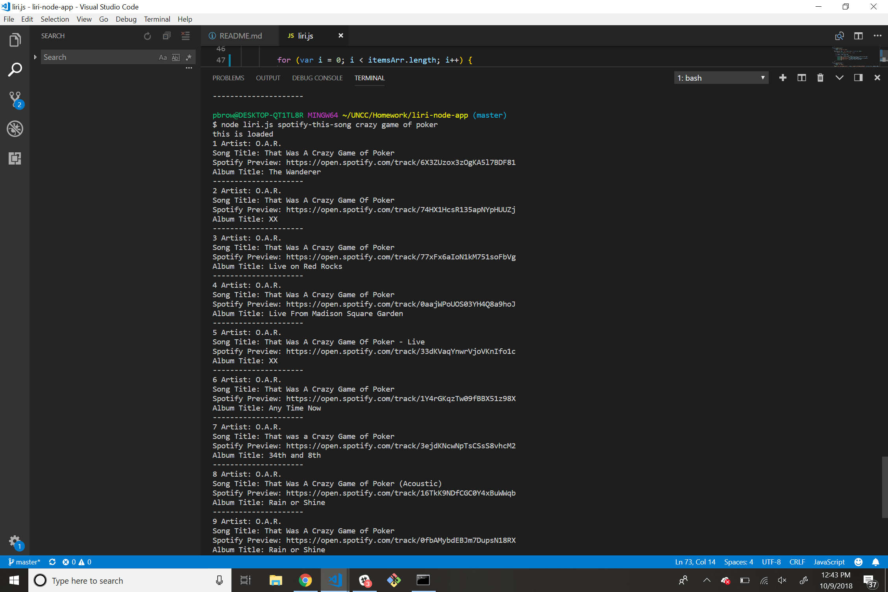

# liri-node-app

In this prokect, I made LIRI. LIRI is like iPhone's SIRI. However, while SIRI is a Speech Interpretation and Recognition Interface, LIRI is a _Language_ Interpretation and Recognition Interface. LIRI will be a command line node app that takes in parameters and gives you back data.

## Photos of the code can be found here: 
;
;
;

## Examples of the functional code:

### movie-this:
;

### concert-this:
;

### spotify-this-song:
;

## Instructions for how to use the node app:
In the CMD line, type node liri.js followed by either movie-this, concert-this, or spotify-this-song followed by what you're looking for. 

For example, if you're looking for upcoming Florence and the Machine concerts, you'd type node liri.js concert-this florence and the machine.

If you were looking for information on a specific movie, you'd type node liri.js movie-this *movie name*. 

If you wanted information about a song, you'd type node liri.js spotify-this-song *song name*

